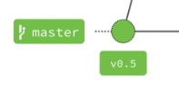
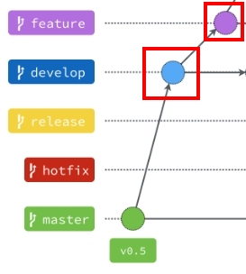
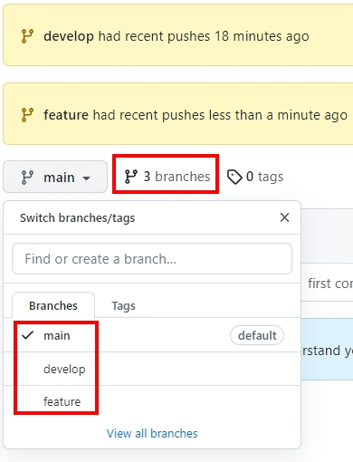
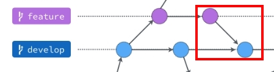

# 最常用的開發流程 — Git flow

# 開發流程

常見的開發流程：

```
1. **Git flow**
2. GitHub Flow
3. Gitlab Flow
```

上述三套流程，大致上都有一個共同點，就是他們都是以**特性驅動開發** (**Feature-driven development，簡稱 FDD**)，是一個模型驅動(model-driven)、短期迭代(short-iteration)的過程，過程中會有起點與終點。

起點是需求，先有了需求後，再開啟 Feature branch 或 Hotfix branch ，當完成專案以後，將分支的更新合併到原先的分支上（主分支），出來的分支再被刪除。

因為一開始接觸到的與比較熟悉的流程為Git flow，所以本篇就主要講解Git flow基礎概念與實作。

# What is Git flow?


`master`、`develop` 這兩個分支又被稱做長期分支，因為他們會一直存活在整個 Git Flow 裡，而其它的分支大多會因任務結束而被刪除。

### **Master 分支**

1. 主要是用來放穩定、隨時可上線的版本，Prod版本。
2. 開發者不會直接 Commit 到這個分支。
3. 因為是穩定版本，所以通常也會在這個分支上的 Commit 上打上版本號標籤。

### **Develop 分支**

1. 所有開發的基礎分支。

### **Hotfix 分支**

1. 當Master分支發生緊急問題的時候，開出來緊急修復的分支。
2. Hotfix 分支修復完成之後，會合併回 Master 分支，也同時會合併一份到 Develop 分支。
3. 為什麼一開始不從 Develop 分支切出來修？因為 Develop 分支的功能可能尚在開發中。

### **Release 分支**

1. Master分支的試run版本。

### **Feature 分支**

1. 當接到新需求要開始開發的時候就是使用 Feature 分支的時候了。
2. Feature 分支都是從 Develop 分支來的，完成之後會再併回 Develop 分支。

# 日常會遇到的情況

### 老闆叫你開發一個網站

- 你必須把你新創的專案建立Master分支並丟上Github。
    
    
    

```jsx
git init
git add .
git commit -m "first commit"
git **branch** -M main 
git remote add origin https://github.com/<username>/<reponame>.git
git push -u origin main
```

### 老闆叫你開發一個新功能

- 你必須開一個develop還有feature分支，然後push上Github。
    
    
    

```jsx
git **branch** develop   #建立develop分支
git branch feature   #建立feature分支
git **checkout** feature  #切換到feature分支
--Switched to branch 'feature'--

git branch            #這個時候可以看一下自己位於哪個分支，*號代表當前位置
--***feature** --
-- develop --
-- main    --

git push --set-upstream origin <分支名稱>  #將分支push上去的方法
```

- Push完後就會看到你的Github repo內有三個分支：main(master)、develop、feature啦。
    
    
    

- 最後在feature分支開發完新功能後，要merge回去develop分支。



```jsx
git checkout develop   #切換回develop分支
git **merge** feature      #合併feature分支
git branch -d feature  #刪除feature分支
```

<aside>
💡 其實在各個branch之間工作，最主要的指令也只有checkout、branch、merge而已。

</aside>

## 糟糕！遇到衝突了！？

- 當你開開心心的想要merge任何你想要merge的分支時，commit一下發現…

```jsx
git branch
-- ***develop** --
--  feature --
--  main    --

git merge feature  #當前分支merge feature分支
-- Auto-merging index.html --
-- CONFLICT (content): Merge conflict in index.html -- 
-- Automatic merge failed; fix conflicts and then commit the result. --
```

<aside>
💡 如果在不同的分支中都修改了同一個檔案的同一部分，Git 就無法合併它們，它會暫停下來等你解決衝突。

</aside>

- 這個時候你應該會看到你的衝突的檔案跳出來，這個時候要手動去解決你要保留哪個

```jsx
//index.html
<<<<<<< HEAD:index.html
console.log('this is develop branch')
=======
console.log('this is feature branch')
>>>>>>> feature:index.html
```

- 將要保留的code替換後，就可以成功merge啦！

```jsx
//index.html
console.log('this is feature branch')
```

# 工作流程應用

[https://www.figma.com/file/h0jnC4SosHmFFV3onOLRVk/%E5%B7%A5%E4%BD%9C%E6%B5%81%E7%A8%8B?node-id=0%3A1](https://www.figma.com/file/h0jnC4SosHmFFV3onOLRVk/%E5%B7%A5%E4%BD%9C%E6%B5%81%E7%A8%8B?node-id=0%3A1)

1. 接到需求文檔，分配個每個人或小組的功能開發後，從master 檢出功能分支。
2. 開發的時候除了會在本地測試，有需要還會合併到dev分支，在公共的開發環境去自己做測試。之所以要pull master是因為在開發功能的期間，可能有hotfix完成合併到master，合併代碼的時候習慣merge一下master，防止衝突。
3. 等自測完成之後，申請合併到release，合併成功後部署到測試環境後通知測試人員做測試。
4. 測試通過後，release申請合併到master，準備上線。
5. 如果測試不通過，在功能分支修改後重新merge。
6. 上線成功穩定後刪除對應的功能分支，dev 合併最新的master分支。