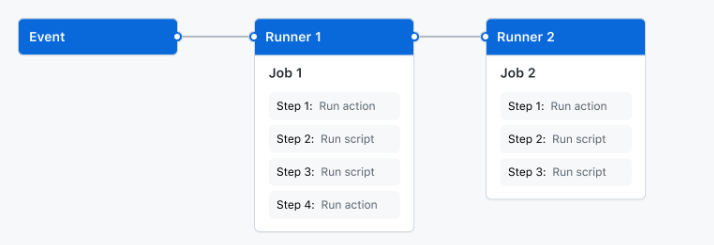

# 初探 Github actions

> GitHub Actions 是一種持續集成和持續交付 (CI/CD) 平台，可用於自動執行生成、測試和部署管道。
> 

# ****The components of GitHub Actions****

## Overview

您可以將 GitHub Actions 工作流配置為在存儲庫中發生事件時觸發，例如打開拉取請求或創建問題。您的****Workflows****包含一個或多個可以按順序或併行運行的Job。每個Job都將在其自己的虛擬機運行程序或容器內運行，並且具有一個或多個步驟，可以運行您定義的腳本或運行Actions，這是一種可重用的擴展，可以簡化您的****Workflows****。



## ****Workflows****

****Workflows****是一個可配置的自動化過程，它將運行一個或多個Job。****Workflows****由簽入到存儲庫的 YAML 文件定義，並在存儲庫中的事件觸發時運行，也可以手動觸發，或按定義的時間表觸發。 ****Workflows****在存儲庫的 .github/workflows 目錄中定義，存儲庫可以有多個****Workflows****，每個****Workflows****都可以執行不同的任務集。例如，您可以有一個****Workflows****來構建和測試拉取請求，另一個****Workflows****用於在每次創建發佈時部署應用程序，還有一個****Workflows****每次有人打開新議題時添加標籤。

## ****Events****

****Events****是存儲庫中觸發工作流運行的特定活動。例如，當有人創建拉取請求、打開問題或將提交推送到存儲庫時，活動可能源自 GitHub。您還可以通過發佈到 REST API 或手動觸發按計劃運行的****Workflows****。

## Job

Job是工作流中在同一****Runners****上執行的一組步驟。每個步驟要么是一個將要執行的 shell 腳本，要么是一個將要運行的動作。步驟按順序執行並且相互依賴。由於每個步驟都在同一個****Runners****上執行，因此您可以將數據從一個步驟共享到另一個步驟。例如，您可以有一個構建應用程序的步驟，然後是一個測試已構建應用程序的步驟。 您可以配置一個Job與其他Job的依賴關係；默認情況下，Job沒有依賴關係並且彼此並行運行。當一個Job依賴於另一個Job時，它將等待依賴的Job完成才能運行。例如，您可能有多個不依賴於不同架構的構建Job，以及依賴於這些Job的打包Job。構建Job將並行運行，當它們全部成功完成後，打包Job將運行。

## Actions

Actions是 GitHub Actions 平台的自定義應用程序，它執行複雜但經常重複的任務。使用Actions來幫助減少您在工作流文件中編寫的重複代碼量。Actions可以從 GitHub 拉取您的 git 存儲庫，為您的構建環境設置正確的工具鏈，或設置對您的雲提供商的身份驗證。 您可以編寫自己的Actions，也可以在 GitHub Marketplace 中找到要在您的工作流程中使用的Actions。

## ****Runners****

****Runners****是在觸發工作流時運行您的工作流的服務器。每個跑步者一次可以運行一個作業。 GitHub 提供 Ubuntu Linux、Microsoft Windows 和 macOS ****Runners****來運行您的工作流程；每個工作流運行都在一個全新的、新配置的虛擬機中執行。 GitHub 還提供更大的****Runners****，它們有更大的配置。有關更多信息，請參閱“使用更大的跑步者”。如果您需要不同的操作系統或需要特定的硬件配置，您可以託管自己的****Runners****。

# YAML file in .github/workflows

```yaml
name: learn-github-actions
run-name: ${{ github.actor }} is learning GitHub Actions
on: [push]
jobs:
  check-bats-version:
    runs-on: ubuntu-latest
    steps:
      - uses: actions/checkout@v3
      - uses: actions/setup-node@v3
        with:
          node-version: '14'
      - run: npm install -g bats
      - run: bats -v
```

To help you understand how YAML syntax is used to create a workflow file, this section explains each line of the introduction's example:

| name: learn-github-actions | Optional - 將顯示在 GitHub repository的“Actions”選項卡中的workflow 名稱。 |
| --- | --- |
| run-name: ${{ github.actor }} is learning GitHub Actions | Optional - 從workflow生成的workflow運行的名稱，將顯示在repository的“Actions”選項卡上的workflow運行列表中。此示例使用帶有 github 上下文的表達式來顯示觸發workflow運行的參與者的用戶名。 |
| on: [push] | 指定此workflow的觸發器。此示例使用push 事件，因此每次有人將更改推送到repository 或合併拉取請求時都會觸發workflow運行。這是由push 到每個分支觸發的；有關僅在push 到特定分支、路徑或標籤時運行的語法示例。 |
| jobs: | 將在 learn-github-actions 工作流中運行的所有作業組合在一起。 |
| check-bats-version: | 定義一個名為 check-bats-version 的Job。子鍵將定義作業的屬性。 |
|   runs-on: ubuntu-latest | 將job 配置為在最新版本的 Ubuntu Linux 運行程序上運行。這意味著該job 將在 GitHub 託管的全新虛擬機上執行。 |
|   steps: | 將 check-bats-version job中運行的所有步驟組合在一起。此部分下嵌套的每個項目都是一個單獨的操作或 shell 腳本。 |
|     - uses: actions/checkout@v3 | 使用關鍵字uses 指定此步驟將運行v3actions/checkout的action操作 。這是一個將您的repository 簽出到運行器上的操作，允許您針對您的代碼運行腳本或其他操作（例如構建和測試工具）。每當您的工作流將針對存儲庫的代碼運行時，您都應該使用 checkout 操作。 |
|     - uses: actions/setup-node@v3
      with:
        node-version: '14' | 此步驟使用 action/setup-node@v3 action 安裝指定版本的 Node.js（本示例使用 v14）。這會將 node 命令和 npm 命令都放在您的 PATH 中。 |
|     - run: npm install -g bats | run 關鍵字告訴作業在runner上執行命令。在這種情況下，您使用 npm 安裝 bats 軟件測試包。 |
|     - run: bats -v | 最後，您將使用輸出軟件版本的參數運行 bats 命令。 |