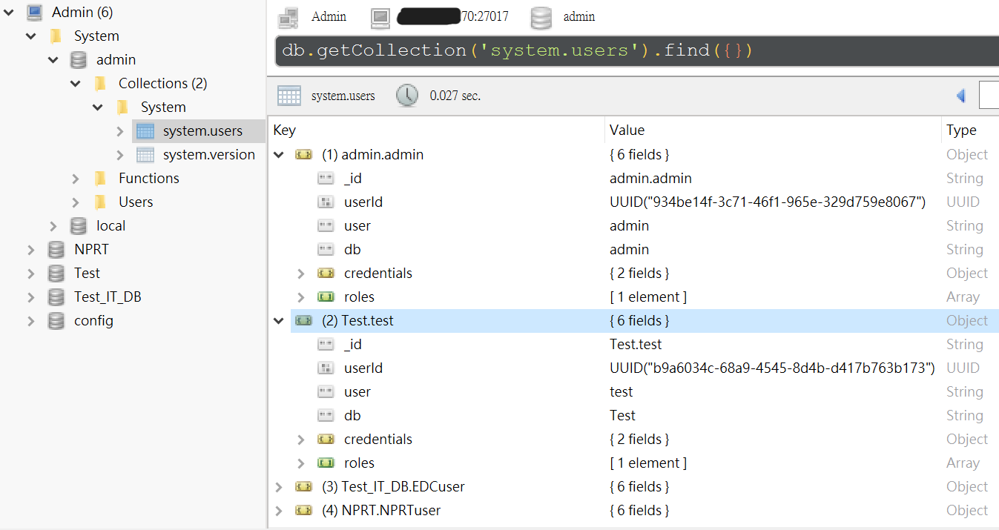

# 權限管理

# 環境

MongoDB : 5.0

Env : Windows 10

# 為什麼要進行權限管理的設置

- mongodb默認不使用權限認證方式啟動
- 與MySQL不同，mongodb在安裝的時候並沒有設置權限
- 公開運行系統需要設置權限以保證數據安全與設定連線

# mongodb的權限管理方案

- MongoDB沒有默認管理員帳號，所以要先添加管理員帳號
- 並且mongodb服務器需要在運行的時候開啟驗證模式
- 用戶只能在用戶所在數據庫登錄(創建用戶的數據庫)，包括管理員。



你可以在管理員帳號創立之後，查看其他user帳戶&他所管理的資料庫。

# 創建超級管理員

## cd到mongo.exe所在的目錄

```powershell
D:
cd D:\MongoDB\Server\5.0\bin
```


## 進入mongo shell

```powershell
mongo

#MongoDB shell version v5.0.6
#connecting to: mongodb://127.0.0.1:27017/?compressors=disabled&gssapiServiceName=mongodb
#Implicit session: session { "id" : UUID("79963327-2383-4425-8d50-3cf16dc90742") }
#MongoDB server version: 5.0.6
#================
#Warning: the "mongo" shell has been superseded by "mongosh",
#which delivers improved usability and compatibility.The "mongo" shell has been deprecated and will be removed in
#an upcoming release.
#For installation instructions, see
#https://docs.mongodb.com/mongodb-shell/install/
#================
#>
```

## 切換到admin數據庫(超級管理員必須創建在該數據庫上)

```powershell
use admin
#switched to db admin
#>
```

## 創建超級用戶

```powershell
db.createUser({"user":"admin","pwd":"password","roles":["root"]})
#Successfully added user：{ "user" : "admin", "roles" : [ "root" ] }

exit #退出
```

## 修改mongod.cfg

```
# mongod.conf

# for documentation of all options, see:
#   http://docs.mongodb.org/manual/reference/configuration-options/

...

# network interfaces
net:
  port: 27017
  bindIp: 0.0.0.0       **#先修改為0.0.0.0皆允許通過，之後要改再改**
  # bindIp: 127.0.0.1

#processManagement:

#security:
security.authorization : enabled   **#打開驗證**
...
```

## 登錄驗證

```powershell
use admin
#switched to db admin
db.auth('admin','password')
#1  (成功)
```

# 創建普通用戶

## 選擇需要創建用戶的數據庫

```powershell
use Test_IT_DB
db.createUser({user:"blogUser",pwd: "blogPassword",roles: [{ role: "readWrite", db: "blogs-db"}]})
```

## 創建

```powershell
db.createUser({user:"EDCuser",pwd: "EDCpassword",roles: [{ role: "readWrite", db: "Test_IT_DB"}]})
```

## 或是在Admin數據庫上新增其他數據庫的普通用戶

```powershell
use admin
db.createUser({"user":"testuser", "pwd":"testpassword", 
roles:[
		{"role":"read","db":"dbname1"},
		{"role":"readWrite","db":"dbname2"}
	]
})

db.createUser({'user': 'blogs-db-user','pwd': 'changeit','roles': [{ role: 'readWrite', db: 'blogs-db' }]});
```

# 其他指令

## 查看創建的用戶

```powershell
show users
#{
#    "_id" : "admin.admin",
#    "user" : "admin",
#    "db" : "admin",
#    "roles" : [
#        {
#            "role" : "root",
#            "db" : "admin"
#        }
#    ]
#}
```

## 刪除用戶

```powershell
use db_name
db.dropUser('user_name')
```

# 連線資料庫

## Robo 3T

### Create connections


### Connection欄位

新增Address


### Authentication欄位


### 測試

可以按下左下的Test按鈕測試


### 連結

連結後即可用登入的帳號的權限使用遠端資料庫


## Node.js — express

### model/index.js

```jsx
const mongoose = require('mongoose')

module.exports = () => {
    mongoose.set('useFindAndModify', false)
    mongoose.connect(
        `mongodb://${ACCOUNT}:${PASSWORD}@${HOST}:${PORT}/${DBNAME}`,
        {
            useUnifiedTopology: true,
            useNewUrlParser: true
        }
    )

    mongoose.connection.on('error', console.error.bind(console, 'connection error:'))
    mongoose.connection.once('open', () => console.log('Database connect success...'))
}
```

### app.js

```jsx
const createError = require('http-errors')
const express = require('express')
const path = require('path')
...
const mongoose = require('./model')
mongoose()
```

### GO!

```powershell
npm run dev
#Database connect success...
```